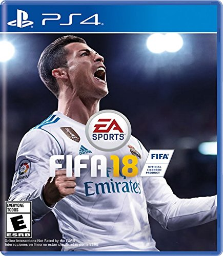
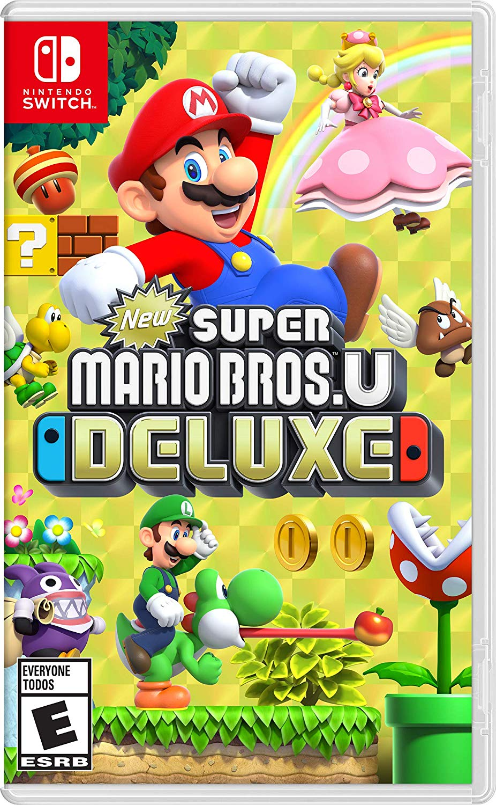
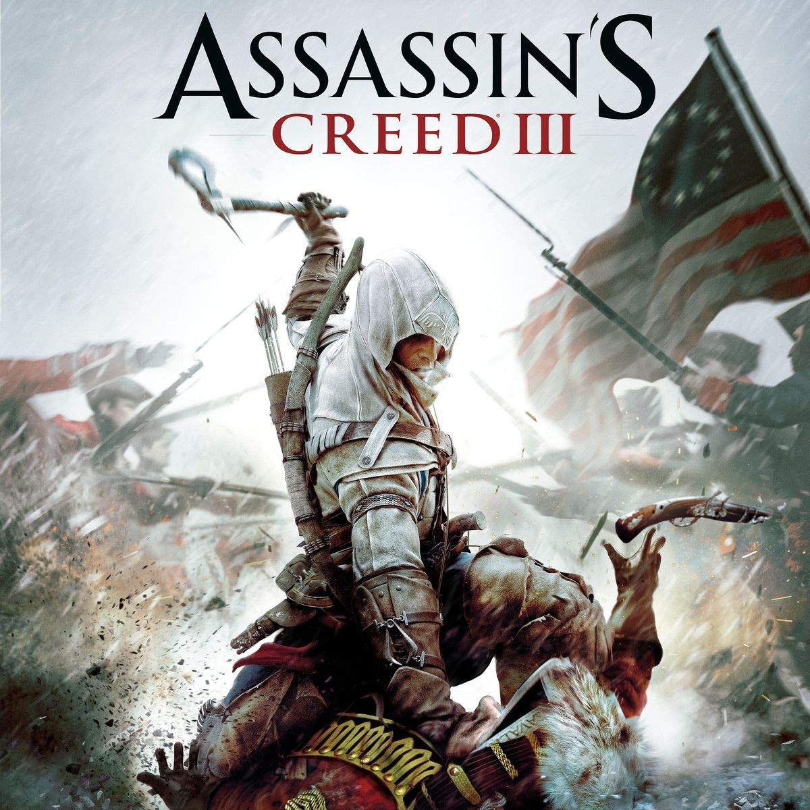
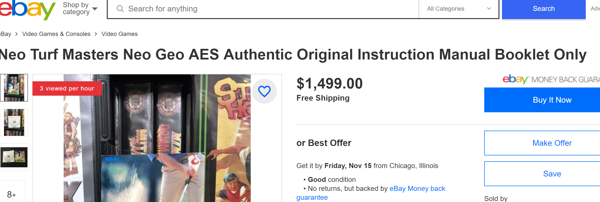
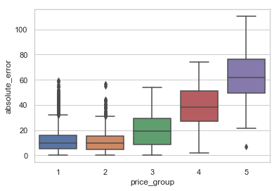
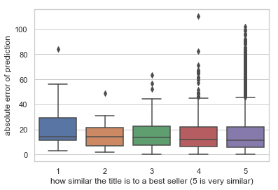

# Price Prediction for Video Games

This project provides machine-leaning based prediction of second-hand video game prices by using limited internet data sources. By using information such as genres and developer names, the algorithms are able to predict prices to a certain extent. Here are some results based on the best model: 


|         |             | |
| --- |---| --- |
| price @ $17.8   | price @ $43.5 | price @ $7.7 |
|prediction @ $18.04 * |prediction @ $40.08 * |prediction @ $17 *|

*All pictures are from google. Prices are averages from all available platforms.

This document will briefly explain the following:

  - [Installation](#installation)
  - [Data Description and Cleaning](#Data-Description-and-Cleaning)
  - [Models and Performance](#Models-and-Performance)
  - [Findings](#Findings)
  - [Further Studies](#Further-Studies)
  
If the reader wishes to skip the nuances on data collection, cleaning and model choices, please skip straight to the section "Findings" by clicking the above link.

### Installation
----------------------------------
##### Download Source Data (optional)
  - rawg (https://rawg.io)
  - price chart (www.pricecharting.com)
  
##### Download Intermediate Data to run the notebooks
- all the pickle files in the folder "data"

##### Install the Requirements
  Install the requirements using ```pip install -r requirements.txt```
  
  Two third-party packages are essential for this project:
   - [API Python Wrappers for rawg](rawg) 
   - [Instruction on installing glove-python](glove_python)
  (Technical reference on the GloVe model can be found [here](GloVe))
   

Please refer to the links above if you run into any problems.

### Data Description and Cleaning
----------------------------------
##### Files
- GetGameData_Final.ipynb
- CleanGameData_Final.ipynb

##### Prices
  - All the prices are second hand for games sold either on ebay.com or pricecharting.com
  - The source is a paid dataset from pricecharting.com. Please click [here](pricechartprice) for the price methodology.
  - This project uses the "New Price" among other prices available on pricecharting.com

##### Outliers

  - Some data are outliers probably due to data entry issues: for example, a game with a regular price of $14.99 is listed as $1499 in the database. Such points are rare but do exist. 
  - More often, we have true outliers such as the following title:
  
  
     
  
  
  
    - [This game](neo), Neo Turf Masters, is an arcade style golf simulation game that was launched in 1996 by Nazca (before acquired by SNK). The game is apparently beloved by many and has been re-released on many up-to-date platforms including PS4 and Nintendo Switch. The average price is a whopping $50K in the dataset while the median price of all games is $24
    - The price actually makes sense since the game in our database is probably the one for the original console (the AES system) which is extremely rare and highly sought after. As a side note, the manual pamphlet alone on the game for the AES system was listed at $1499 on [ebay](ebay)
    
 
            

   - Both kinds of outliers have been filtered out using the inter-quartile range method where any points beyond 1.5 times the 25-75 quantiles range are deleted.
   
##### Features
- Information on genres, tags, developers, platforms are obtained from rawg. One-hot encoding has been applied on the most common items for those information. The number of items in each feature was also added as separate features
- GloVe model was used to obtain word vectors. The goal was to learn useful information from game titles based on their context. For example, Mario games are expected to have more similar prices. Two different weights were used (mean and TFIDF) during validation
- A feature called "best-sellers-similarity-score" was obtained by taking the minimum of the Euclidean distance between the sentence vector of the game and the sentence vectors of the best selling 500 games in the dataset ("sales-volumes" was used). Again, games from The Legend of Zelda series would automatically be expected to land a higher benchmark due to its successful ancestors
- An average TFIDF score was obtained for each game title as a substitute feature for the word vectors. TFIDF is to learn the significance of a game title by only analyzing word frequencies among all available titles in the dataset.

### Models and Performance
----------------------------------
##### Files
- DataAnalysis_Final.ipynb

##### Baseline
- Random Forest Regressor on a dataset using only the length of the game title as the relevant feature on the game titles (without English stopwords)

##### Models
- Random Forest Regressor, XGBoost, SVR and Linear Regression (lasso) were chosen. It is expected the former three would perform better as the data is essentially non-linear. 
- Instead of the length of the title (baseline), four different datasets were explored: "best-sellers-similarity-score" ("best") only, "best" plus mean word vectors, "best" plus TFIDF weighted vectors, and "best" plus average TFIDF score on the titles.

##### Training/Validation/Test
- As there is sufficient data, the dataset was randomly split into 60/20/20 for train, validation and test datasets. 

### Findings
----------------------------------
##### Files
- Final_Results.ipynb

##### Model Selection

Surprisingly, not a lot of the models outperform the baseline in terms of mean absolute errors. However, there's an improvement in terms of the variance of the prediction.

The baseline models has a prediction mean absolute error of $16.35 and a standard deviation of error of $17.35.

Please find below the mean absolute error for each of the model other than the baseline after validation:

|data/model | RF     | XGBoost      |Linear| SVR      |
|---- | --- | --- | --- | --- |
|only Similarity Score    | 18.66      | 16.27  | 18.16 | 16.02
|+mean word vectors   | 16.97 | 16.12 | 17.73| 16.15
|+TFIDF word vectors   | 16.92       | 16.54 |17.77|16.18|
|+average TFIDF score   | 17.88      | 16.4| 18.35| 16.28|

The standard deviation of the prediction error:

|data/model | RF     | XGBoost      |Linear| SVR      |
|---- | --- | ---| --- | --- |
|only Similarity Score    | 19.57      | 16.75  | 16.27 | 18.07
|+mean word vectors   | 15.78 | 17.43 | 16.21| 18.41
|+TFIDF word vectors   | 15.51      | 16.1 |16.23|18.48|
|+average TFIDF score   | 17.61     | 17.53| 16.54| 18.65|

Finally, the best model is XGBoost on TFIDF weighted word vectors due to its relatively low mean absolute error and standard deviation.

It is worth noting that while the prediction works with some games, the errors are larger in more expensive games and on ones with similar titles to best sellers -- in contrary to what was assumed.

  

 

This might help to explain why certain predictions on many big franchise names tend to have an above average error. As these games are popular, many titles were issued and some of them might not be so impressive (ex., Assassin's Creed 3 compared to its predecessors or the more recent versions such as Origins or Odysseys). More often than not, developers rush to meet the deadline, hoping that its good name in the past will help. 

Another reason of this wide price error range might be related to those companies issuing special editions on popular titles for collectors (e.g., limited collections, collector's edition) that up skews the price tag significantly while a normal edition would cost much less and be more in line with the general market. One example would be that "Assassins Creed Brotherhood Collectors Edition" is on average $64 while the normal edition is only $7. It seems that the "collector's value" or "vintage value" is a factor that is hard to assess correctly in this model.

### Further Studies
----------------------------------
- A better model/feature to predict the collector's value mentioned above
- The word vector might be improved by learning through the description of the games
- It might be worthy to separate game titles by platforms: a pokemon monster game on PS2 is a totally different title than the one on 3DS as the PS2 console is almost obsolete
- Improve the missing data : some prices can be missing for a unknown reason
- Using a Stacking Ensemble model might provide some improvement


[//]: # (These are reference links used in the body of this note and get stripped out when the markdown processor does its job. There is no need to format nicely because it shouldn't be seen. Thanks SO - http://stackoverflow.com/questions/4823468/store-comments-in-markdown-syntax)


   [rawg]: https://rawg.io/apidocs
   [glove_python]: https://github.com/maciejkula/glove-python/wiki/Installation-on-Windows
   [GloVe]: https://nlp.stanford.edu/projects/glove/
   [pricechartprice]: https://www.pricecharting.com/page/methodology
   [ebay]: https://www.ebay.com/itm/Neo-Turf-Masters-Neo-Geo-AES-Authentic-Original-Instruction-Manual-Booklet-Only/163926090169?hash=item262ac1a1b9:g:qNAAAOSwxcJdu4Zl
   [neo]: https://en.wikipedia.org/wiki/Neo_Turf_Masters
   