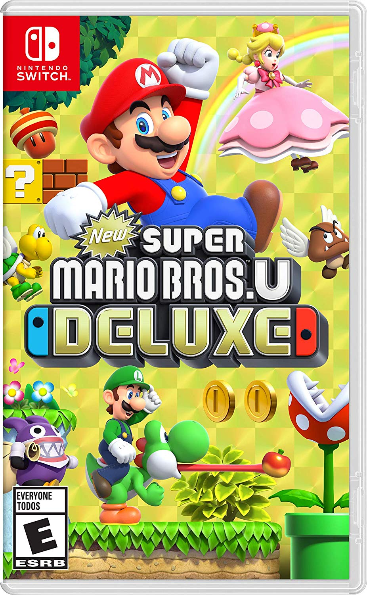
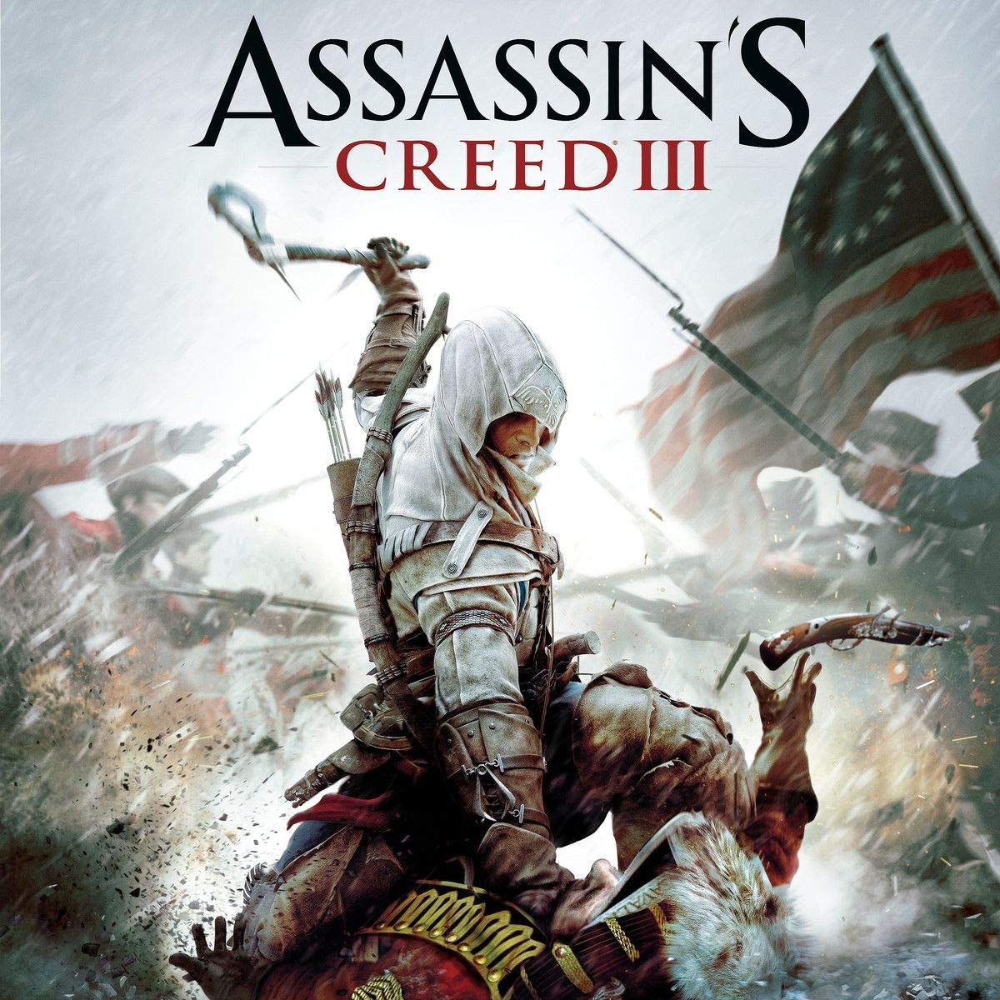
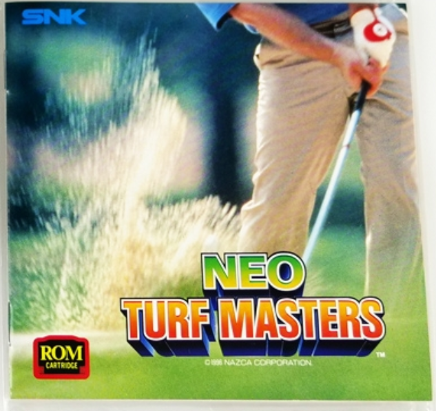
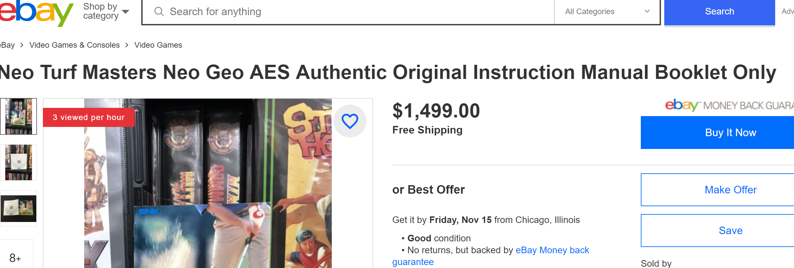
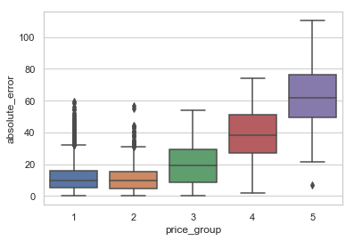
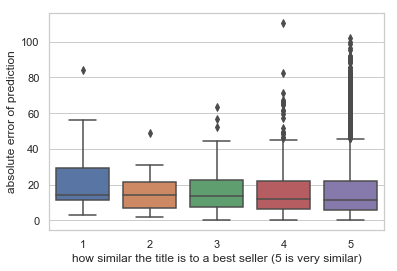

# Price Prediction for Video Games

This project aims to provide prediction on second hand video games using machine learning tools. By using information such as genres and developer names, we are able to predict prices to a certain extent (but only to a certain extent). Here are some examples: 


|         |             | |
| --- |---| --- |
| price @ $17.8 prediction @ $18.04 *   | price @ $43.5 prediction @ $40.08 *| price @ $7.7 prediction @ $17 *|

*Pictures are all from google. Prices are the average of ones from all available platforms

This document will briefly explain the following:

  - [Installation](#installation)
  - [Data Description and Cleaning](#Data-Description-and-Cleaning)
  - [Models and Performance](#Models-and-Performance)
  - [Findings](#Findings)
  - [Further Studies](#Further-Studies)
  
If the reader wishes to skip details on data collection, cleaning and model choices, please jump to the section Findings for final results.

### Installation
----------------------------------
##### Download the Source Data (optional)
  - rawg (https://rawg.io)
  - price chart (www.pricecharting.com)
  
##### Download Intermediate Data to run the notebooks
- all the pickle files

##### Install the Requirements
  Install the requirements using ```pip install -r requirements.txt```
  2 third-party packages are essential for this project:
   - [Api Python Wrappers for rawg](rawg) 
   - [Instruction on installing Glove-python](glove_python)
   - Techinical reference on the GloVe model can be found [here](GloVe)
   

Please refer to the links above if you run into any problem.

### Data Description and Cleaning
----------------------------------
##### Files
- GetGameData_Final.ipynb
- CleanGameData_Final.ipynb

##### Prices
  - All the prices are second hand prices for games sold either on ebay or pricecharts.com
  - The ultimate source is a paid dataset from pricecharts.com. Please find [here](pricechartprice) their price methodology.
  - This project uses the "New Price"

##### Outliers

  - Some data is outliers due to data entry issues: for example, a game with a regular price of $14.99 is listed $1499 in the database. Such points are rare but do exist. 
  - More often, we have true outliers such as the following:
  
  
     
  
  
  
    - [This game](neo), Neo Turf Masters, is an arcade style golf simulation game that was launched in 1996 by Nazca (before acquired by SNK). The game is apparently beloved by many fans and has been re-released on many platforms including PS4 and Nintendo Switch. The average price is over $50K among data points with a mean price of $24
    - The price seems to make sense as the game in our database is probably the one with the original console (the aes system with home catridge) which is extremely rare and highly sought after. As a side note, the game manual alone on AES system is listed about $1500 on [ebay](ebay)
    
 
            

   - Both kinds of outliers have been filtered using the inter-quatnile range method where any points beyond 1.5 times the 25-75 quantiles range are deleted.
   
##### Features
- Information on genres, tags, developers, platforms are obtained from rawg. One-hot encoding has been applied on the most common items. Number of items in each features was also added as separate features
- GloVe model was used to obtain word vectors. 2 weights were used (mean and tfidf)
- A feature called "best-sellers-similarity-score" was obtained by taking the minimum of the Euclidean distance between the sentence vector of the game and the ones of the best selling 500 games in the dataset ("sales-volumes" was used)
- An average tfidf score was obtained for each game title.

### Models and Performance
----------------------------------
##### Files
- DataAnalysis_Final.ipynb

##### Baseline
- Random Forest Regressor on a data using only the length of the game title as the feature involving the title (without English stopwords)

##### Models
- Random Forest Regressor, XGBoost, SVR and Linear Regression (lasso)
- 4 different datasets were explored: instead of the length of the title, mean word vectors, tfidf weighted vectors, average tfidf for the title and "best-sellers-similarity-score" were included in the training and tests.

##### Training/Validation/Test
- As there are sufficient data, the dataset was split into 60/20/20 without cross-validation

### Findings
----------------------------------
##### Files
- Final_Results.ipynb

##### Model Selection

Surprisingly, not a lot of the models outperform the baseline in temrs of mean absolute errors. However, there's an improvement in terms of the variance of the prediction.

The baseline has a mean absolute error of $16.35 and a standard deviation of $ 17.35 in prediction.

Please find below the mean absolute error for each of the model:

|data/model | RF     | XGBoost      |Linear| SVR      |
|---- | --- | --- | --- | --- |
|only Similarity Score    | 18.66      | 16.27  | 18.16 | 16.02
|+mean word vectors   | 16.97 | 16.12 | 17.73| 16.15
|+tfidf word vectors   | 16.92       | 16.54 |17.77|16.18|
|+average tfidf score   | 17.88      | 16.4| 18.35| 16.28|

The standard deviation of the prediction absolute error:

|data/model | RF     | XGBoost      |Linear| SVR      |
|---- | --- | ---| --- | --- |
|only Similarity Score    | 19.57      | 16.75  | 16.27 | 18.07
|+mean word vectors   | 15.78 | 17.43 | 16.21| 18.41
|+tfidf word vectors   | 15.51      | 16.1 |16.23|18.48|
|+average tfidf score   | 17.61     | 17.53| 16.54| 18.65|

Finally, the model chosen is XGBoost on tfidf word vectors due to it's relatively low mean absolute error and standard deviation.

It is worth noting that while the prediction works with some games, the errors are larger in expensive games and games that are similar to best sellers in terms of titles.

  

 

This might explain the fact that predictions on many big franchise names tend to have an above average error. As these games are popular, many sequels can be issued and some of them might not be so impressive (ex., assassin's creed 3 compared to its predecessors or the more recent versions such as origins or odysseys). It is also worth pointing out that franchise games are more likely to issue special edition for collectors (i.e., limited collections, collector's edition, etc) that up skews the price tag while a normal edition with only the game content would cost much less. One example would be that "assassins creed brotherhood collectors edition" is priced on average at $64 while the normal edition is $7. The collector's value is a factor that is hard to assess.

### Further Studies
----------------------------------
- A better model/feature to include the collector's value mentioned above
- The word vector might be improved by learning through the description of the games
- It might be worthy to separate game titles by platforms: a pokemon monster game on PS2 is a totally different thing than the one on 3DS as PS2 is almost obsolete
- Improve the missing data : prices can be missing for a reason
- Stacking Ensemble might provide some improvement


[//]: # (These are reference links used in the body of this note and get stripped out when the markdown processor does its job. There is no need to format nicely because it shouldn't be seen. Thanks SO - http://stackoverflow.com/questions/4823468/store-comments-in-markdown-syntax)


   [rawg]: https://rawg.io/apidocs
   [glove_python]: https://github.com/maciejkula/glove-python/wiki/Installation-on-Windows
   [GloVe]: https://nlp.stanford.edu/projects/glove/
   [pricechartprice]: https://www.pricecharting.com/page/methodology
   [ebay]: https://www.ebay.com/itm/Neo-Turf-Masters-Neo-Geo-AES-Authentic-Original-Instruction-Manual-Booklet-Only/163926090169?hash=item262ac1a1b9:g:qNAAAOSwxcJdu4Zl
   [neo]: https://en.wikipedia.org/wiki/Neo_Turf_Masters
   